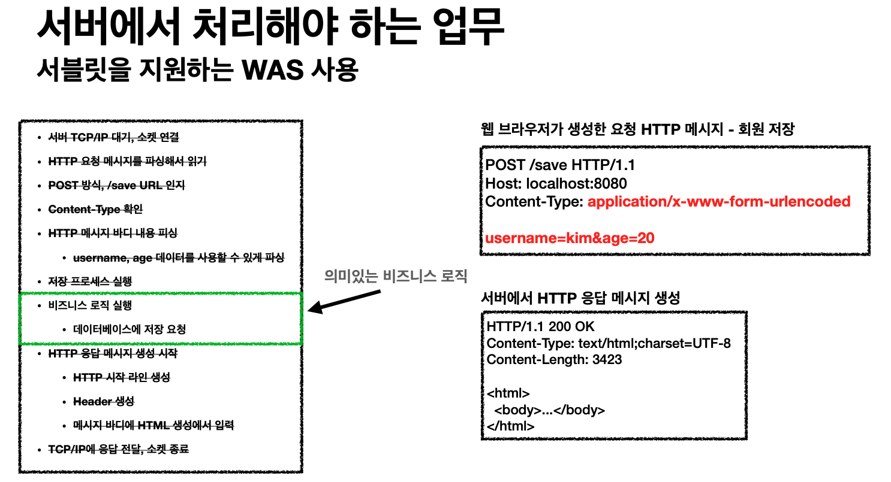
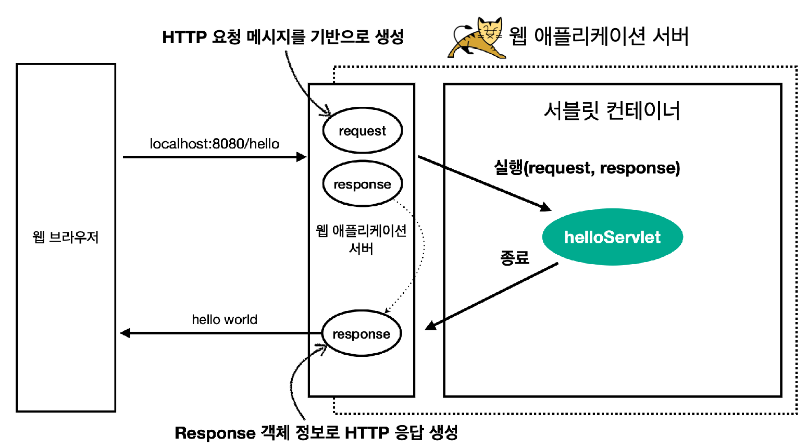
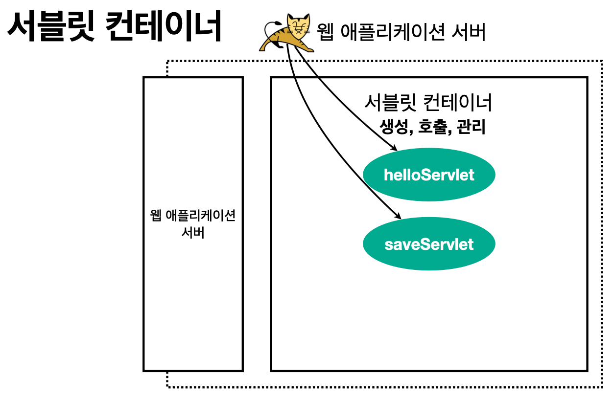

# 스프링 MVC 1편 - 백엔드 웹 개발 핵심 기술

## 웹 서버 (Web Server)

- HTTP 기반
- 정적 리소스만 표현할 수 있다.
  - HTML, IMG, JS, CSS ...
- 예) NGINX, APACHE

## 웹 애플리케이션 서버 (WAS : Web Application Server)

- HTTP 기반
- 웹 서버 기능 + 프로그램 코드를 실행하는 애플리케이션 로직 추가
  - 동적 HTML, HTTP API (JSON)
  - 서블릿, JSP, 스프링 MVC
- 예) 톰캣, Jetty, Undertow

## 서블릿

### HTTP 요청, 응답 흐름

- HTTP 요청 시
  - WAS 는 Request, Response 객체를 새로 만들어서 서블릿 객체 호출
  - 개발자는 Request 객체에서 HTTP 요청 정보를 편리하게 꺼내서 사용
  - 개발자는 Response 객체에 HTTP 응답 정보를 편리하게 입력
  - WAS 는 Response 객체에 담겨있는 내용으로 HTTP 응답 정보를 생성

### 서블릿 컨테이너

- 톰캣처럼 서블릿을 지원하는 WAS 를 서블릿 컨테이너라고 한다.
- 서블릿 컨테이너는 서블릿 객체를 생성, 초기화, 호출, 종료하는 생명주기를 관리한다.
- 서블릿 객체는 `싱글톤`으로 관리한다.
  - 고객의 요청이 들어올 때마다 계속 객체를 생성하는 것은 비효율 적이다.
  - 최초 로딩 시점에 서블릿 객체를 미리 만들어두고 재활용하여 사용한다.
  - 모든 고객 요청은 동일한 서블릿 객체 인스턴스에 접근한다.
  - 공유 변수 사용 시 주의 해야한다. (사용 금지)
  - 서블릿 컨테이너 종료 시 함께 종료된다.
- JSP 도 서블릿으로 변환 되어서 사용된다.
- 동시 요청을 위한 멀티 쓰레드 처리를 지원한다.

## 쓰레드

### 요청마다 쓰레드 생성 장단점

- 장점
  - 동시 요청을 처리할 수 있다.
  - 리소스 (CPU, 메모리)가 호용할 때까지 처리할 수 있다.
  - 하나의 쓰레드가 지연 되어도 나머지 쓰레드는 정상 동작한다.
- 단점
  - 쓰레드 생성 비용은 매우 비싸다.
    - 고객의 요청이 올 때마다 쓰레드를 생성하면, 응답 속도가 매우 늦어진다.
  - 쓰레드는 `컨텍스트 스위칭` 비용이 발생한다.
    - 컨텍스트 스위칭: 이전의 쓰레드 context 정보를 저장해두었다가 새로운 쓰레드 정보를 읽어서 사용하고,  
                        새로운 쓰레드가 끝났을 때 저장해 두었던 쓰레드 context 를 불러오는 작업
  - 쓰레드 생성에 제한이 없다.
    - 고객 요청이 너무 많으면 CPU, 메모리 임계점을 넘어서 서버가 죽을 수 있다.

### 쓰레드 풀

> 요청마다 쓰레드 생성의 단점을 보완하자.

- 특징
  - 필요한 쓰레드를 쓰레드 풀에 미리 만들어서 보관해두고 관리한다.
  - 쓰레드 풀에 생성 가능한 쓰레드의 최대치를 관리한다. 톰캣은 최대 200개가 기본 설정이다. (변경가능)
- 사용
  - 쓰레드가 필요하면, 이미 생성 되어 있는 쓰레드를 쓰레드 풀에서 꺼내서 사용한다.
  - 사용을 종료하면 쓰레드 풀에 해당 쓰레드를 반납한다.
  - 최대 쓰레드가 모두 사용 중이어서 쓰레드 풀에 쓰레드가 없다면?
    - 기다리는 요청은 거절하거나 특정 숫자만큼만 대기하도록 설정할 수 있다.
- 장점
  - 쓰레드가 미리 생성되어 있으므로, 쓰레드를 생성하고 종료하는 비용 (CPU)이 절약되고, 응답 시간이 빠르다.
  - 생성 가능한 쓰레드의 최대치가 있으므로 너무 많은 요청이 들어와도 기존 요청은 안전하게 처리할 수 있다.

#### 실무 팁

- WAS 의 주요 튜닝 포인트는 최대 쓰레드 (max thread) 수이다.
- 이 값을 너무 낮게 설정하면?
  - 동시 요청이 많으면, 서버 리소스는 여유롭지만 클라이언트는 금방 응답이 지연된다.
- 이 값을 너무 높게 설정하면?
  - 동시 요청이 많으면, CPU, 메모리 리소스 임계점 초과로 서버가 다운될 수 있다.
- 장애 발생 시?
  - 클라우드면 일단 서버부터 늘리고, 이후에 튜닝을 한다.
  - 클라우드가 아니라면 열심히 미리미리 튜닝을 해두어야 한다.

#### 쓰레드 풀 적정 숫자

- 애플리케이션 로직의 복잡도, CPU, 메모리, IO 리소스 상황에 따라서 모두 달라진다.
- 성능 테스트로 적정 수를 찾는 게 중요하다.
  - 최대한 실제 서비스와 유사하게 성능 테스트를 진행한다.
  - 툴: 아파치 ab, 제이미터, nGrinder

### WAS의 멀티 쓰레드 지원

- 멀티 쓰레드에 대한 부분은 WAS 가 처리한다.
- `개발자가 멀티 쓰레드 관련 코드를 신경쓰지 않아도 된다.`
- 개발자는 마치 싱글 쓰레드 프로그래밍을 하듯이 편리하게 소스 코드를 개발할 수 있게 된다.
- 멀티 쓰레드 환경이므로 싱글톤 객체 (서블릿, 스프링 빈)는 주의해서 사용해야 한다.

## 서버 사이드 렌더링, 클라이언트 사이드 렌더링

- SSR - 서버 사이드 렌더링
  - HTML 최종 결과를 서버에서 만들어서 웹 브라우저에 전달
  - 주로 정적인 화면에 사용
  - 관련기술: JSP, 타임리프 -> `백엔드 개발자`
- CSR - 클라이언트 사이드 렌더링
  - HTML 결과를 자바스크립트를 사용해 웹 브라우저에서 동적으로 생성해서 적용
  - 주로 동적인 화면에 사용, 웹 환경을 마치 앱처럼 필요한 부분부분만 변경할 수 있음.
  - 예) 구글 지도, Gmail, 구글 캘린더
  - 관련기술: React, Vue.js -> `웹 프론트엔드 개발자`
- 참고
  - React, Vew.js 를 CSR + SSR 동시에 지원하는 웹 프레임워크도 있음.
  - SSR 을 사용하더라도, 자바스크립트를 사용해서 화면 일부를 동적으로 변경할 수 있음.

## 요청 파라미터 vs HTTP 메시지 바디
- 요청 파라미터를 조회하는 기능(get or Html Form): `@RequestParam`, `@ModelAttribute`
- HTTP 메시지 바디를 직접 조회하는기능: `@RequestBody`

### @ResponseBody
- `@ResponseBody` 를 사용하면 응답 결과를 HTTP 메시지 바디에 직접 담아서 전달할 수 있다.
- 물론 이 경우에도 view를 사용하지 않는다.

### @RequestBody는 생략 불가능
- `@RequestBody` 를 생략하면, `@ModelAttribute` 가 붙어서 HTTP 메시지 바디가 아니라, 요청 파라미터 정보를 읽으려고 한다.